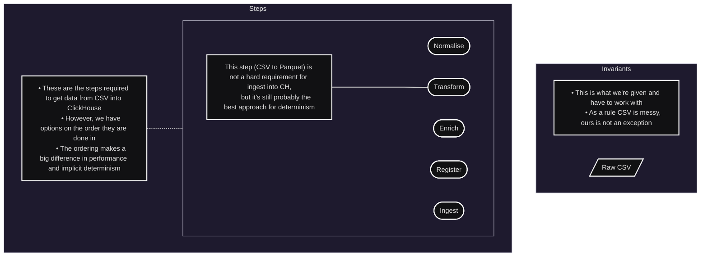

# UnifiedIngestor Architecture

## Executive Summary

The UnifiedIngestor system ingests high-volume CSV timeseries files, resolves long string series keys to integer IDs, and writes rows into ClickHouse while keeping the hot ingest path fast and non-blocking.

**Core Innovation:** Bind series names to integer IDs at write time using a ClickHouse dictionary, allow unknown names to land with ID 0, then reconcile later with a background worker that replays only the unresolved rows. This deferred reconciliation pattern keeps the hot path fast while ensuring downstream tables remain keyed on integers with no query-time binding costs.

## One Sentence Summary

Ingest uses ClickHouse as a deterministic compiler and write-time binder, unresolved rows land with ID 0, and a background worker registers missing keys then re-emits only the unresolved subset so downstream tables remain keyed on integers and never pay query-time binding costs.

## Design Principles

This implementation follows the architectural principles established in the companion white papers:

1. **Transformation semantics must match ingestion semantics** - clickhouse-local is ClickHouse itself, ensuring identical parsing and type coercion
2. **Stage-based filesystem workflow** - provides idempotency, auditability, and crash recovery
3. **Typed Parquet as the intermediate contract** - stable, performant, and inspectable
4. **Correctness before convenience** - downstream trust is a first-class constraint
5. **Operational clarity** - failures must be diagnosable without heroic debugging

## Goals

1. **High throughput on lots of small files** - handle high-volume CSV deliveries efficiently
2. **Deterministic parsing and typing** - consistent interpretation throughout the pipeline
3. **Bind identity once** - resolve string keys to integer IDs without repeated lookups
4. **Non-blocking ingestion** - new series registration happens asynchronously
5. **Integer-keyed ClickHouse tables** - physical storage uses efficient integer keys

## Vocabulary

- **timeseries_name**: Long string key from CSV files (column name in input is `ts`)
- **timeseries_id**: Integer surrogate key, authoritative mapping stored in Postgres
- **dict**: ClickHouse dictionary that replicates the Postgres mapping for fast local lookup
- **unresolved**: Row where timeseries_id is 0 because mapping did not exist at ingest time
- **ingest_batch_id**: UUID written with rows to scope queries, used for both ingest batches and reconciliation insert batches
- **hot path**: The primary ingestion flow handling existing, known timeseries (majority of traffic)
- **cold path**: The background reconciliation flow handling new timeseries registration

## The Problem Space

Understanding the building blocks helps clarify why the deferred reconciliation pattern is necessary.

### The Fundamental Steps

Every CSV-to-ClickHouse pipeline must perform these operations, though the order can vary significantly:



The critical decision is **when to perform enrichment/registration** relative to the other steps. This decision has profound implications for throughput, latency, and system complexity.

## Approach Comparison

### Sequential Approach

The sequential approach checks for series existence before ingestion and registers new series synchronously in the hot path.

```mermaid
---
config:
  theme: redux-dark
---
flowchart LR

n(["Registration is only required for new timeseries which are a tiny percentage of total"])

subgraph Flows["Processing Flows"]
    subgraph Alt["New Timeseries - Alternative Order"]
        CSVA[/Raw CSV/] -->
        NormaliseA(["Normalise"]) --> 
        NCSVA[/Normalised CSV/] -->
        newA(["Get New TS"]) --> 
        regA(["Register with PG"]) -->
        TransformA(["Transform"]) -->
        ParquetA[/Parquet/] -->
        pgA[("Postgres")] -->    
        IngestA(["Ingest"])     
    end

    subgraph Main["New Timeseries - Transform First"]
        CSV[/Raw CSV/] -->
        Normalise(["Normalise"]) --> 
        NCSV[/Normalised CSV/] -->
        Transform(["Transform"]) -->
        Parquet[/Parquet/] -->
        new(["Get New TS"]) --> 
        reg(["Register with PG"]) -->
        pg[("Postgres")] -->    
        Ingest(["Ingest"])     
    end

    subgraph Hot["Existing Timeseries - Hot Path"]
        CSVH[/Raw CSV/] -->
        NormaliseH(["Normalise"]) --> 
        NCSVH[/Normalised CSV/] -->
        TransformH(["Transform"]) -->
        ParquetH[/Parquet/] -->
        pgH[("Postgres")] -->    
        IngestH(["Ingest"])     
    end
end

subgraph Clickhouse["ClickHouse"]
    tsraw[["raw.ts"]] --> silver[["silver"]] --> gold[["gold"]]                        
end
 
Ingest --> tsraw
IngestA --> tsraw
IngestH --> tsraw


classDef warning  fill:#422006,stroke:#f59e0b,stroke-width:2,color:#fffbeb;

class new,reg,newA,regA,n warning

classDef sghot fill:#020617, stroke:#34d399, stroke-width:2,rx:12,ry:12;
classDef sgNew fill:#020617, stroke:#60a5fa, stroke-width:2;
classDef sgNewDashsed fill:#020617, stroke:#60a5fa, stroke-dasharray:6 6,stroke-width:2;
classDef sgContainer fill:#020617, stroke-width:2;
classDef sgCanvas fill:transparent, stroke:transparent, stroke-width:2,rx:12,ry:12;
classDef sgLegend fill:#020617, stroke-width:2,rx:12,ry:12;

class T sgLegend;
class Con2 sgCanvas;
class Main sgNew;
class Clickhouse,Consolidated,Con sgContainer
class Alt sgNewDashsed
class Hot sghot;
````
**Notes**

- This is the high-level sequential logical flow as implied from a C#-only ingest process
- Physical implementation specifics like caches are not covered
- The order could be adjusted, as shown by the two flows
- The 'Hot path' flow shows what is required for almost all data we receive

**How it works:**

For each file, the system must determine which timeseries are new (not yet registered) and which are known:

1. Parse the CSV to extract all unique timeseries names
2. Query Postgres to check which names already have IDs
3. For new names: register them in Postgres and wait for ID assignment
4. Transform the CSV to Parquet, joining with the ID mappings
5. Ingest the Parquet into ClickHouse

**Characteristics:**

- **Synchronous blocking**: New series registration blocks the ingestion of that file
- **Postgres in the hot path**: Every file requires at least one Postgres query (check for existing IDs)
- **Simple mental model**: Each file is completely processed before moving to the next
- **No deferred work**: Once ingestion completes, all rows are fully resolved

**Performance implications:**

- Network round-trip to Postgres for every file
- New series cause additional latency (INSERT + wait for ID)
- Batch processing helps but doesn't eliminate the blocking behavior
- Works well for low-volume or when most series are pre-registered

**When this works well:**

- Low file volume (hundreds per day, not thousands)
- Stable timeseries catalog (few new registrations)
- Acceptable to have occasional slow files when new series appear
- Simpler codebase is worth the throughput tradeoff

### Deferred Approach: RDBMS World

To understand the deferred approach, it helps to see how you would implement it in a traditional RDBMS context first.

```mermaid
---
config:
  theme: redux-dark
---
flowchart TB

subgraph Staging["Staging Database"]
    db[("staging.timeseries
    (id = 0 for unknown)")]     
    db2[("production.timeseries
    (only resolved rows)")]
    db --"periodic promotion
    (WHERE id > 0)"--> db2
end
  
subgraph HotPath["Hot Path - Always Non-Blocking"]
    CSVc[/Raw CSV/] -->
    Normalisec(["Normalise"]) --> 
    NCSVc[/Normalised CSV/] -->
    Transformc(["Transform"]) -->
    Parquetc[/Parquet/] -->                    
    Ingestc(["Ingest with
    LEFT JOIN to ID mapping"]) 
    Ingestc --"existing: id > 0"--> db
    Ingestc --"new: id = 0"--> db
end

subgraph ColdPath["Cold Path - Registration Loop"]
    loop(["Every N seconds"]) -->
    detect(["1. Detect unresolved
    (WHERE id = 0)"]) -->
    register(["2. Register new series
    with Postgres"]) -->
    replay(["3. Re-insert unresolved rows
    with new IDs"]) -->
    promote(["4. Promote to production
    (WHERE id > 0)"])
    
    detect --"read unresolved"--> db
    register --"write new IDs"--> pg[("Postgres
    (source of truth)")]
    replay --"update staging"--> db
    promote --"write resolved"--> db2
end

class new,reg,newA,regA,n warning

classDef sgHot fill:#020617, stroke:#34d399, stroke-width:2,rx:12,ry:12;
classDef sgNew fill:#020617, stroke:#60a5fa, stroke-width:2;
classDef sgNewDashsed fill:#020617, stroke:#60a5fa, stroke-dasharray:6 6,stroke-width:2;
classDef sgStartDashsed fill:#020617, stroke:#34d399, stroke-dasharray:6 6,stroke-width:2;
classDef sgContainer fill:#020617, stroke-width:2;

class HotPath sgHot;
class Staging sgNew
class ColdPath sgNewDashsed
class loop sgStartDashsed;
class Hot sghot;

```

#### Deferred RDBMS: How It Works

This pattern is common in RDBMS-based systems that need high-throughput ingestion without blocking on reference data lookups.

**Hot Path (Non-Blocking):**

1. Transform CSV to Parquet using clickhouse-local (deterministic parsing)
2. Ingest into `staging.timeseries` with a LEFT JOIN to the ID mapping table
3. Known series get their correct ID immediately
4. Unknown series land with `id = 0` (or NULL, depending on design)
5. **Critically:** Ingestion never waits or fails due to missing IDs

**Cold Path (Background Worker):**

1. **Detect**: Query `staging.timeseries WHERE id = 0` to find unresolved rows
2. **Register**: INSERT new series into Postgres to get authoritative IDs
3. **Replay**: Re-insert the unresolved rows from staging, this time with real IDs
4. **Promote**: Move rows with `id > 0` to the production table

**Why the staging table?**

In RDBMS world, you need a separate staging table because:

- Production tables should only contain clean, fully-resolved data
- You want ACID guarantees around the "resolve and promote" operation
- The staging table acts as a queue for deferred work
- Queries against production tables never see unresolved rows

**Key insight:**

The deferred pattern splits the work into two phases:

- **Phase 1 (hot)**: Get data in quickly, even if incomplete
- **Phase 2 (cold)**: Clean up and complete the data in the background

This is a proven pattern in high-throughput systems (e.g., event streaming, CDC pipelines).

### Deferred Approach: ClickHouse World

ClickHouse allows us to implement the deferred pattern more elegantly using dictionaries and materialized views.

```mermaid
---
config:
  theme: redux-dark
---
flowchart TB

subgraph Staging["    "]
    StagingLayerTitle["Staging Layer"]:::tSection
    dict[/"tsname_dict
    (Postgres-backed dictionary)"\]
    db[["staging.ts_stage
    (all rows, resolved & unresolved)"]]                
    mv["raw.stage_to_raw_mv
    (promotes WHERE id > 0)"]
    
    dict -.->|"dictGet() during INSERT"| db
    db -->|"automatic trigger"| mv
end

subgraph Production[" "]
    ProductionLayerTitle["Production Layer"]:::tSection
    tsraw[["raw.timeseries"]] --> silver[["silver"]] --> gold[["gold"]]  
    
end
  
subgraph HotPath["  "]
    HotPathTitle["Hot Path - Always Non-Blocking"]:::tSection
    CSVc[/Raw CSV/] -->
    Normalisec(["Normalise"]) --> 
    NCSVc[/Normalised CSV/] -->
    Transformc(["Transform
    (clickhouse-local)"]) -->
    Parquetc[/Parquet/] -->                    
    Ingestc(["INSERT SELECT
    with dictGet()"]) 
    Ingestc --"id = dictGet(name)
    (0 if not found)"--> db    
end

subgraph ColdPath["  "]
    ColdPathTitle["Cold Path - Registration Loop"]:::tSection 
    loop(["Every N seconds"]) -->
    detect(["1. Detect unresolved
    using dictHas()"]) -->
    register(["2. Bulk register
    via pg_remote table"]) -->
    wait(["3. Wait for dict refresh"]) -->
    replay(["4. Re-insert with
    dictGet() for new IDs"])
    
    detect -.->|"dictHas() check"| dict
    register -->|"INSERT via remote"| pg[("Postgres
    (source of truth)")]
    replay -->|"INSERT SELECT"| db
end
mv -->|"only id > 0"| tsraw
HotPathTitle---CSVc

ColdPathTitle---loop
StagingLayerTitle --- dict
gold --- ProductionLayerTitle 

%% classDef staging fill:#e3f2fd,stroke:#1976d2,stroke-width:2px
%% classDef hot fill:#c8e6c9,stroke:#388e3c,stroke-width:2px
%% classDef cold fill:#fff3e0,stroke:#f57c00,stroke-width:2px
%% classDef prod fill:#f3e5f5,stroke:#7b1fa2,stroke-width:2px

%% class dict,db,mv staging
%% class CSVc,Normalisec,NCSVc,Transformc,Parquetc,Ingestc hot
%% class loop,detect,register,wait,replay cold
%% class tsraw,silver,gold prod
linkStyle 18 stroke:transparent,stroke-width:2px;
linkStyle 19 stroke:transparent,stroke-width:2px;
linkStyle 20 stroke:transparent,stroke-width:2px;
linkStyle 21 stroke:transparent,stroke-width:2px;

classDef tSection fill:transparent,stroke:transparent,color:#e5e7eb,font-family:Consolas,font-size:22px,font-weight:800;
classDef warning fill:#422006,stroke:#f59e0b,stroke-width:2,color:#fffbeb;
class new,reg,newA,regA,n warning

classDef sghot fill:#020617, stroke:#34d399, stroke-width:2,rx:12,ry:12;
classDef sgNew fill:#020617, stroke:#60a5fa, stroke-width:2;
classDef sgNewDashsed fill:#020617, stroke:#60a5fa, stroke-dasharray:6 6,stroke-width:2;
classDef sgStartDashsed fill:#020617, stroke:#34d399, stroke-dasharray:6 6,stroke-width:2;
classDef sgContainer fill:#020617, stroke-width:2;
classDef sgClickhouseDashed fill:#020617, stroke:#FFDF0E, stroke-dasharray:6 6,stroke-width:2;
classDef sgClickhouse fill:#020617, stroke:#FFDF0E;

class ColdPath sgNewDashsed;
class Clickhouse,RDBMS,Staging sgContainer
class Register sgNewDashsed
class loop sgStartDashsed;
class HotPath sghot;
class Staging sgClickhouseDashed;
class Production sgClickhouse;
```



#### Deferred ClickHouse: How It Works

ClickHouse's dictionaries and materialized views make this pattern both elegant and performant.

**Hot Path (Non-Blocking):**

1. Transform CSV to Parquet using clickhouse-local (deterministic parsing)
2. INSERT into `staging.ts_stage` with `dictGet('tsname_dict', 'id', timeseries_name)`
3. Known series: `dictGet()` returns the real ID
4. Unknown series: `dictGet()` returns 0 (default for missing keys)
5. **All rows land in staging** regardless of resolution status

**Materialized View (Automatic Promotion):**

```sql
-- Materialized view automatically promotes resolved rows
CREATE MATERIALIZED VIEW raw.stage_to_raw_mv TO raw.timeseries AS
SELECT *
FROM staging.ts_stage
WHERE timeseries_id > 0;
```

The MV acts as a **filter trigger**: as soon as a row has `timeseries_id > 0`, it's automatically promoted to the production `raw.timeseries` table.

**Cold Path (Background Worker):**

1. **Detect**: Use `dictHas('tsname_dict', timeseries_name)` to find unresolved names
   - This is more efficient than scanning for `id = 0`
   - Leverages ClickHouse's optimized dictionary engine

2. **Register**: Bulk INSERT into Postgres via `staging.pg_timeseries_remote`
   ```sql
   INSERT INTO staging.pg_timeseries_remote (timeseries_name, ingestion_key)
   SELECT DISTINCT 
       timeseries_name,
       base64Encode(timeseries_name) as ingestion_key
   FROM staging.ts_stage
   WHERE NOT dictHas('tsname_dict', timeseries_name);
   ```

3. **Wait for dictionary refresh**: 
   - Dictionary has `LIFETIME(1)` (refreshes every 1 second)
   - Could poll `system.dictionaries.last_successful_update_time` for certainty

4. **Replay unresolved rows**:
   ```sql
   INSERT INTO staging.ts_stage
   SELECT 
       dictGet('tsname_dict', 'id', timeseries_name) as timeseries_id,
       timeseries_name,
       -- ... all other columns
       generateUUIDv4() as ingest_batch_id  -- new batch ID for tracking
   FROM staging.ts_stage
   WHERE timeseries_id = 0;
   ```

5. **Automatic promotion**: The MV sees the new rows with `id > 0` and promotes them

**Why This Is Better Than RDBMS:**

1. **Dictionaries are fast**: In-memory, vectorized lookups
2. **Materialized views are automatic**: No manual promotion code
3. **No transaction overhead**: ClickHouse's eventual consistency model fits naturally
4. **Bulk operations**: All lookups and inserts are vectorized
5. **Less code**: Leverage ClickHouse primitives rather than application logic

**Why staging.ts_stage keeps duplicates:**

- Unresolved rows remain with `id = 0`
- When replayed, new resolved rows are inserted with `id > 0`
- This creates an audit trail of the resolution process
- Downstream systems read from `raw.timeseries` (via MV) which has no duplicates
- `staging.ts_stage` can have aggressive TTL if audit trail not needed

## Data Stores and Objects

### Postgres

**Table: public.timeseries**

The authoritative source of truth for timeseries ID mappings.

- **Columns**: `id` (serial), `timeseries_name` (text, unique), `ingestion_key` (text), metadata fields
- **Purpose**: Single source of truth for name → ID mappings
- **Access pattern**: Bulk writes from ClickHouse via remote table, reads via dictionary refresh

### ClickHouse

#### 1. staging.tsname_dict

ClickHouse dictionary backed by Postgres, provides fast local lookups.

```sql
CREATE DICTIONARY staging.tsname_dict (
    timeseries_name String,
    id UInt32
)
PRIMARY KEY timeseries_name
SOURCE(POSTGRESQL(...))
LAYOUT(HASHED())
LIFETIME(MIN 1 MAX 1);  -- Refresh every 1 second
```

- **Source**: Postgres `public.timeseries` table
- **Primary key**: `timeseries_name`
- **Refresh mechanism**: `LIFETIME(1)` ensures fresh data
- **Default behavior**: `dictGet()` returns 0 for missing keys

#### 2. staging.ts_stage

MergeTree table storing all ingested rows, including unresolved rows.

**Key columns:**

- `timeseries_id` (UInt32) - 0 for unresolved, >0 for resolved
- `timeseries_name` (String) - the series key from CSV
- `period_start`, `period_end`, `published_date_time` (DateTime64) - temporal fields
- `quantity` (Decimal128(18)) - the measurement value
- `as_of_date_time`, `model_as_of_date_time` (DateTime64) - versioning fields
- `source_file` (String) - original CSV filename
- `source_type` (Enum8) - 'RAW' or 'DERIVED'
- `extras` (String) - JSON for additional metadata
- `ingest_batch_id` (UUID) - batch tracking identifier
- `staged_at` (DateTime64) - timestamp of insertion

**Order by**: `(timeseries_id, timeseries_name)` for efficient filtering

**Characteristics:**

- Acts as an audit log of all ingestion attempts
- Contains duplicates by design (unresolved + resolved versions)
- Can be queried for debugging and replay scenarios
- Aggressive TTL recommended if audit trail not needed long-term

#### 3. raw.stage_to_raw_mv

Materialized view that promotes only resolved rows.

```sql
CREATE MATERIALIZED VIEW raw.stage_to_raw_mv TO raw.timeseries AS
SELECT 
    timeseries_id,
    timeseries_name,
    period_start,
    period_end,
    published_date_time,
    quantity,
    as_of_date_time,
    model_as_of_date_time,
    source_file,
    source_type,
    extras,
    ingest_batch_id,
    staged_at
FROM staging.ts_stage
WHERE timeseries_id > 0;
```

- **Trigger**: Fires on every INSERT to `staging.ts_stage`
- **Filter**: Only rows with `timeseries_id > 0` are promoted
- **Target**: `raw.timeseries` (the production table)
- **Effect**: Automatic, immediate promotion of resolved rows

#### 4. staging.pg_timeseries_remote

ClickHouse PostgreSQL engine table for writing back to Postgres.

```sql
CREATE TABLE staging.pg_timeseries_remote (
    timeseries_name String,
    ingestion_key String
)
ENGINE = PostgreSQL(
    'postgres_host:5432',
    'database',
    'timeseries',
    'user',
    'password'
);
```

- **Purpose**: Bulk insert new series from ClickHouse to Postgres
- **Engine**: PostgreSQL remote table engine
- **Access pattern**: Write-only from ClickHouse perspective
- **Benefit**: Avoids application-layer serialization and network overhead

## System Architecture

### Hot Path (IngestWorker)

The hot path handles the majority of traffic and must be fast and non-blocking.

**Responsibilities:**

1. File stability and acquisition
2. Header normalization
3. CSV to Parquet transformation
4. Dictionary-based ID resolution
5. Ingestion into staging

**Flow:**

```
CSV files → Stability check → Header normalize → 
clickhouse-local (CSV → Parquet) → 
INSERT SELECT with dictGet() → 
staging.ts_stage (with id = 0 or id > 0) →
Materialized view promotes id > 0 to raw.timeseries
```

**Performance characteristics:**

- No Postgres round trips
- No blocking on new series
- Vectorized dictionary lookups
- Batch file processing
- Predictable latency

### Cold Path (RegistrationWorker)

The cold path runs asynchronously and resolves unresolved rows.

**Responsibilities:**

1. Detect unresolved series
2. Bulk register with Postgres
3. Wait for dictionary refresh
4. Replay unresolved rows
5. File lifecycle management

**Flow:**

```
Periodic check → dictHas() to detect unresolved → 
Bulk INSERT to Postgres via pg_remote → 
Wait for dictionary refresh → 
Re-INSERT unresolved rows with dictGet() → 
Materialized view promotes newly resolved rows →
Move files from reg/ to done/
```

**Performance characteristics:**

- Runs every N seconds (configurable)
- Bulk operations only
- Does not block hot path
- Handles backpressure gracefully

## Component Details

### IngestWorker

**Purpose:** Owns the hot path from raw CSV to staging table.

**Key operations:**

1. **Header normalization:**
   - Standardize column names
   - Add missing required fields with defaults
   - Handle optional fields explicitly

2. **CSV to Parquet transformation:**
   ```bash
   clickhouse-local --query "
       SELECT 
           ts as timeseries_name,
           period_start,
           period_end,
           quantity,
           -- ... all fields
       FROM file('input.csv', CSV)
       FORMAT Parquet
   " > output.parquet
   ```

3. **Ingestion with dictionary binding:**
   ```sql
   INSERT INTO staging.ts_stage
   SELECT 
       dictGet('tsname_dict', 'id', timeseries_name) as timeseries_id,
       timeseries_name,
       period_start,
       period_end,
       quantity,
       -- ... all fields
       '{ingest_batch_id}' as ingest_batch_id
   FROM file('output.parquet', Parquet);
   ```

**Why clickhouse-local?**

- **Same engine as server**: Identical parsing and type coercion semantics
- **Deterministic**: Same input always produces same output
- **Fast**: Optimized CSV parsing and Parquet writing
- **Local**: No network overhead
- **Typed**: Parquet enforces schema, catches errors early

**File lifecycle:**

```
smb/incoming/ → inbox/ → normalised/ → staged/ → done/
                                            ↓
                                         error/
```

### RegistrationWorker

**Purpose:** Owns the cold path for series registration and row reconciliation.

**Key operations:**

1. **Detect unresolved series:**
   ```sql
   SELECT DISTINCT timeseries_name
   FROM staging.ts_stage
   WHERE NOT dictHas('tsname_dict', timeseries_name)
   LIMIT 10000;
   ```

2. **Bulk register with Postgres:**
   ```sql
   INSERT INTO staging.pg_timeseries_remote (timeseries_name, ingestion_key)
   SELECT DISTINCT 
       timeseries_name,
       base64Encode(timeseries_name) as ingestion_key
   FROM staging.ts_stage
   WHERE NOT dictHas('tsname_dict', timeseries_name);
   ```

3. **Wait for dictionary refresh:**
   ```sql
   -- Poll system.dictionaries table
   SELECT last_successful_update_time
   FROM system.dictionaries
   WHERE name = 'tsname_dict'
   AND database = 'staging';
   ```

4. **Replay unresolved rows:**
   ```sql
   INSERT INTO staging.ts_stage
   SELECT 
       dictGet('tsname_dict', 'id', timeseries_name) as timeseries_id,
       timeseries_name,
       period_start,
       period_end,
       quantity,
       as_of_date_time,
       model_as_of_date_time,
       source_file,
       source_type,
       extras,
       generateUUIDv4() as ingest_batch_id,  -- New batch ID
       now64(3) as staged_at
   FROM staging.ts_stage
   WHERE timeseries_id = 0;
   ```

**File lifecycle management:**

```
reg/ → (after successful reconciliation) → done/
```

Files are promoted from `reg/` to `done/` only after confirming:

- New series registered in Postgres
- Dictionary refreshed
- Unresolved rows replayed
- Materialized view promoted new rows

## Step-by-Step Flow

### IngestWorker Detailed Flow

1. **File arrival:**
   - Files appear in SMB share or other ingress location
   - Copied to local `inbox/` directory

2. **Stability check:**
   - Wait for file size to stabilize
   - Verify no active write handles
   - Application-level protocol, not OS-level

3. **Header normalization:**
   - Read first line of CSV
   - Map variants to canonical names (`ts`, `TS`, `Timeseries` → `ts`)
   - Add required fields if missing (e.g., `source_type = 'RAW'`)
   - Write normalized CSV to `normalised/` directory

4. **Transform to Parquet:**
   ```bash
   clickhouse-local \
       --input_format_csv_trim_whitespaces=1 \
       --input_format_csv_empty_as_default=1 \
       --query "
           SELECT 
               ts as timeseries_name,
               parseDateTimeBestEffort(period_start) as period_start,
               parseDateTimeBestEffort(period_end) as period_end,
               toDecimal128(quantity, 18) as quantity,
               parseDateTimeBestEffort(published_date_time) as published_date_time,
               coalesce(parseDateTimeBestEffort(as_of_date_time), '0001-01-01'::DateTime64) as as_of_date_time,
               coalesce(parseDateTimeBestEffort(model_as_of_date_time), '0001-01-01'::DateTime64) as model_as_of_date_time,
               '{source_file}' as source_file,
               'RAW' as source_type,
               '' as extras
           FROM file('input.csv', CSVWithNames)
           FORMAT Parquet
       " > output.parquet
   ```
   - Writes typed Parquet to `staged/` directory
   - All type coercion happens here using ClickHouse rules

5. **Ingest into ClickHouse:**
   ```sql
   INSERT INTO staging.ts_stage
   SELECT 
       dictGet('staging.tsname_dict', 'id', timeseries_name) as timeseries_id,
       timeseries_name,
       period_start,
       period_end,
       quantity,
       published_date_time,
       as_of_date_time,
       model_as_of_date_time,
       source_file,
       source_type,
       extras,
       generateUUIDv4() as ingest_batch_id,
       now64(3) as staged_at
   FROM file('output.parquet', Parquet);
   ```

6. **Dictionary resolution:**
   - `dictGet()` looks up ID for each `timeseries_name`
   - Known series: returns real ID (e.g., 12345)
   - Unknown series: returns 0 (default)
   - **No blocking**: ingestion proceeds regardless

7. **Materialized view promotion:**
   - MV triggers automatically on INSERT
   - Filters `WHERE timeseries_id > 0`
   - Writes matching rows to `raw.timeseries`
   - Unresolved rows (id = 0) stay only in staging

8. **File promotion:**
   - Move CSV from `normalised/` to `done/`
   - Move Parquet from `staged/` to `done/`
   - Or move to `reg/` if file needs reconciliation tracking

### RegistrationWorker Detailed Flow

1. **Periodic trigger:**
   - Runs every N seconds (e.g., 30-60 seconds)
   - Can be triggered manually for operational reasons

2. **Detect unresolved series:**
   ```sql
   SELECT DISTINCT timeseries_name
   FROM staging.ts_stage
   WHERE NOT dictHas('staging.tsname_dict', timeseries_name)
   LIMIT 10000;
   ```
   - Uses `dictHas()` for efficiency (O(1) lookup)
   - Could alternatively query `WHERE timeseries_id = 0` but slower

3. **Check if work needed:**
   ```csharp
   if (unresolvedNames.Count == 0) {
       logger.LogInformation("No unresolved series, skipping cycle");
       return;
   }
   ```

4. **Bulk register new series:**
   ```sql
   INSERT INTO staging.pg_timeseries_remote (timeseries_name, ingestion_key)
   SELECT DISTINCT 
       timeseries_name,
       base64Encode(timeseries_name) as ingestion_key
   FROM staging.ts_stage
   WHERE NOT dictHas('staging.tsname_dict', timeseries_name);
   ```
   - Single bulk INSERT, not per-row
   - Postgres assigns IDs via SERIAL column
   - `ingestion_key` is for deduplication and tracking

5. **Wait for dictionary refresh:**
   ```csharp
   // Simple approach: fixed delay
   await Task.Delay(TimeSpan.FromSeconds(2));
   
   // Better approach: poll dictionary update time
   var lastUpdate = await QueryDictionaryLastUpdate();
   var maxWait = DateTime.UtcNow.AddSeconds(10);
   while (lastUpdate < registrationTime && DateTime.UtcNow < maxWait) {
       await Task.Delay(TimeSpan.FromMilliseconds(500));
       lastUpdate = await QueryDictionaryLastUpdate();
   }
   ```
   - Dictionary has `LIFETIME(1)` so refreshes every second
   - Polling `system.dictionaries` is more reliable than fixed delay

6. **Verify dictionary refresh:**
   ```sql
   SELECT dictHas('staging.tsname_dict', timeseries_name) as resolved
   FROM (
       SELECT DISTINCT timeseries_name
       FROM staging.ts_stage
       WHERE timeseries_id = 0
       LIMIT 100
   );
   ```
   - Spot check to ensure dictionary picked up new IDs
   - If not resolved, wait longer or abort with error

7. **Replay unresolved rows:**
   ```sql
   INSERT INTO staging.ts_stage
   SELECT 
       dictGet('staging.tsname_dict', 'id', timeseries_name) as timeseries_id,
       timeseries_name,
       period_start,
       period_end,
       quantity,
       published_date_time,
       as_of_date_time,
       model_as_of_date_time,
       source_file,
       source_type,
       extras,
       generateUUIDv4() as ingest_batch_id,  -- NEW batch ID
       now64(3) as staged_at
   FROM staging.ts_stage
   WHERE timeseries_id = 0;
   ```
   - **New batch ID**: Distinguishes reconciliation batch from original ingest
   - `dictGet()` now returns real IDs (e.g., 67890)
   - Rows are re-inserted with resolved IDs

8. **Materialized view promotion (automatic):**
   - MV sees new rows with `timeseries_id > 0`
   - Automatically writes them to `raw.timeseries`
   - No additional code required

9. **File lifecycle promotion:**
   ```csharp
   // Move files from reg/ to done/
   foreach (var file in Directory.GetFiles("reg/")) {
       var doneFile = file.Replace("reg/", "done/");
       File.Move(file, doneFile);
   }
   ```

10. **Logging and metrics:**
    ```csharp
    logger.LogInformation(
        "Reconciliation complete: {Count} series registered, {Rows} rows replayed",
        unresolvedNames.Count,
        replayedRows
    );
    ```

## Why This Design Is ClickHouse-Friendly

### 1. Physical keying stays on integer ID

ClickHouse tables are ordered by `(timeseries_id, ...)`, not by string. This means:

- **Fast filtering**: `WHERE timeseries_id IN (...)` uses primary key index
- **Compact storage**: UInt32 is 4 bytes vs potentially hundreds for strings
- **Fast JOINs**: Integer equality is vectorized and cache-friendly
- **Efficient aggregation**: Grouping by integers is much faster than strings

### 2. Dictionary lookups are vectorized and cheap

ClickHouse dictionaries are:

- **In-memory**: No disk I/O for lookups
- **Vectorized**: Process thousands of lookups per batch
- **Hashed**: O(1) lookup time
- **Cached**: Hot paths see sub-microsecond latency

A `dictGet()` on a million rows takes milliseconds, not seconds.

### 3. Hot path avoids Postgres round trips per row or per file

Traditional approaches might:

- Query Postgres for each file: "Does series X exist?" (network RTT × file count)
- Query Postgres for each unique series in file: (network RTT × unique series count)

With dictionaries:

- **Zero Postgres queries in hot path**
- All lookups are local to ClickHouse
- Postgres is only touched by background worker

### 4. Unknown series do not stall ingestion

If we blocked on new series:

- Hot path latency becomes unpredictable
- Postgres becomes a bottleneck
- High-throughput scenarios cause queuing

With deferred reconciliation:

- **Hot path latency is constant**
- New series add zero overhead
- Background worker handles backlog at its own pace

### 5. The expensive binding happens once

Once a series is registered and replayed:

- `raw.timeseries` and all downstream tables have integer IDs
- Queries never need to resolve strings to IDs
- No `dictGet()` in analytical queries
- No JOINs to lookup tables in reports

The cost of binding is **paid once at write time**, not repeatedly at query time.

### 6. Materialized views eliminate promotion code

Without MVs, you'd need:

- Application code to detect newly resolved rows
- Periodic queries to find `id > 0` in staging
- Manual INSERT to move rows to production
- State tracking to avoid duplicate promotion

With MVs:

- **Zero application code** for promotion
- **Automatic trigger** on every INSERT
- **Atomic**: Either all rows process or none
- **Efficient**: Only new rows are evaluated

## What This Is Not

### Not query-time identity resolution

This approach does **not** resolve strings to IDs at query time.

**Anti-pattern:**
```sql
-- BAD: dictGet() in every query
SELECT 
    dictGet('tsname_dict', 'id', timeseries_name) as id,
    sum(quantity)
FROM raw.timeseries
GROUP BY id;
```

**This design:**
```sql
-- GOOD: ID already resolved at write time
SELECT 
    timeseries_id,
    sum(quantity)
FROM raw.timeseries
GROUP BY timeseries_id;
```

Query-time resolution would:

- Pay dictionary lookup cost on every query
- Make query performance unpredictable
- Require the dictionary to always be available
- Complicate query planning and optimization

### Not using long series string as ORDER BY in primary analytic tables

This approach does **not** store analytic tables ordered by string keys.

**Anti-pattern:**
```sql
-- BAD: String in ORDER BY of analytic table
CREATE TABLE raw.timeseries (
    timeseries_name String,
    period_start DateTime64,
    quantity Decimal128(18)
)
ENGINE = MergeTree()
ORDER BY (timeseries_name, period_start);  -- String key
```

**This design:**
```sql
-- GOOD: Integer in ORDER BY
CREATE TABLE raw.timeseries (
    timeseries_id UInt32,
    timeseries_name String,  -- Kept for debugging, not in ORDER BY
    period_start DateTime64,
    quantity Decimal128(18)
)
ENGINE = MergeTree()
ORDER BY (timeseries_id, period_start);  -- Integer key
```

String-keyed tables would:

- Consume more disk space
- Have slower filtering and scanning
- Create larger primary indexes
- Slow down JOINs and aggregations

The string is **kept in the table** for debugging and auditing, but it's not in the ORDER BY clause.

## Tradeoffs and Design Decisions

### Accepted Tradeoffs

#### 1. staging.ts_stage contains duplicates

**Why:**

- Unresolved rows remain with `id = 0`
- Replayed rows are re-inserted with real IDs
- Creates an audit trail of the reconciliation process

**Mitigation:**

- Downstream systems read from `raw.timeseries` (via MV) which has no duplicates
- `staging.ts_stage` can have aggressive TTL (e.g., 7 days)
- Clear documentation that staging is not an analytic table
- Queries should never target staging directly

**Alternative considered:**

- UPDATE unresolved rows in place
- **Rejected because:** ClickHouse MergeTree tables don't support efficient UPDATE
- Mutations are expensive and asynchronous
- INSERT is vastly faster than UPDATE in ClickHouse

#### 2. Fixed delay vs observed dictionary refresh

**Current implementation:**

```csharp
await Task.Delay(TimeSpan.FromSeconds(2));
```

**Better implementation:**

```csharp
var lastUpdate = await QueryDictionaryLastUpdate();
var registrationTime = DateTime.UtcNow;
while (lastUpdate < registrationTime) {
    await Task.Delay(TimeSpan.FromMilliseconds(500));
    lastUpdate = await QueryDictionaryLastUpdate();
}
```

**Tradeoff:**

- Fixed delay is simpler but less reliable
- Observed refresh is more correct but adds complexity
- Under normal load, dictionary refreshes in < 2 seconds
- Recommendation: Start simple, add observability if needed

#### 3. Replay all unresolved vs incremental replay

**Current implementation:**

```sql
-- Replay ALL unresolved rows
INSERT INTO staging.ts_stage
SELECT ... FROM staging.ts_stage
WHERE timeseries_id = 0;
```

**Alternative:**

```sql
-- Replay only rows for newly registered series
INSERT INTO staging.ts_stage
SELECT ... FROM staging.ts_stage
WHERE timeseries_id = 0
AND timeseries_name IN (SELECT timeseries_name FROM just_registered);
```

**Tradeoff:**

- Replay-all is simpler and more robust
- Incremental is more efficient if registration is slow
- Under normal operation, unresolved count is small (< 1000 rows)
- Recommendation: Use replay-all unless proven bottleneck

#### 4. Postgres as source of truth vs ClickHouse native

**Why Postgres:**

- Transactional guarantees for ID assignment
- Existing organizational integration
- Established backup and recovery procedures
- Support for complex queries on metadata

**Alternative:**

- Store mappings in ClickHouse `ReplacingMergeTree`
- Use ClickHouse sequences for ID generation

**Tradeoff:**

- Postgres adds external dependency
- ClickHouse-native would be simpler deployment
- Postgres provides ACID guarantees for registration
- Recommendation: Keep Postgres unless deployment constraints force change

### Risks and Mitigations

#### Risk 1: Dictionary refresh failure

**Scenario:** Dictionary stops refreshing, new series registered but never visible.

**Detection:**

```sql
-- Alert if dictionary hasn't updated in 5 minutes
SELECT 
    name,
    last_successful_update_time,
    dateDiff('second', last_successful_update_time, now()) as seconds_since_update
FROM system.dictionaries
WHERE database = 'staging'
AND name = 'tsname_dict'
AND seconds_since_update > 300;
```

**Mitigation:**

- Monitor `system.dictionaries.last_successful_update_time`
- Alert on stale dictionaries
- RegistrationWorker should abort if dictionary doesn't refresh
- Never promote `reg/` files to `done/` if dictionary is stale

#### Risk 2: Postgres connection failure

**Scenario:** Postgres unavailable, registration worker cannot insert new series.

**Impact:**

- Hot path continues to function (dictionary still readable)
- Unresolved rows accumulate in `staging.ts_stage`
- No data loss, but resolution is delayed

**Mitigation:**

- Monitor unresolved row count
- Alert if unresolved count exceeds threshold
- Registration worker retries with exponential backoff
- Once Postgres returns, backlog is processed

#### Risk 3: Unresolved row backlog

**Scenario:** New series arriving faster than registration can keep up.

**Detection:**

```sql
-- Count unresolved rows
SELECT count()
FROM staging.ts_stage
WHERE timeseries_id = 0;
```

**Mitigation:**

- Monitor unresolved count
- Scale registration worker (increase batch size or frequency)
- Investigate why new series rate is abnormally high
- Consider pre-registering known series

#### Risk 4: Replay amplification

**Scenario:** Replaying millions of unresolved rows causes performance impact.

**Impact:**

- Large INSERT into staging
- MV processes large batch
- Temporary spike in resource usage

**Mitigation:**

- Monitor replay batch sizes
- Implement replay in chunks if > 100k rows
- Schedule replays during low-traffic windows
- Consider separate replay queue table

## Failure Mode Analysis

### ClickHouse down

**Impact:**

- Hot path cannot insert
- Files remain in `staged/` directory
- No data loss

**Recovery:**

- Restart ClickHouse
- IngestWorker resumes from last successful file
- Files in `staged/` are reprocessed
- Idempotency via batch_id prevents duplicates in downstream

### Postgres down

**Impact:**

- Registration worker cannot insert new series
- Dictionary cannot refresh (uses cached data)
- Hot path continues with existing dictionary
- Unresolved rows accumulate

**Recovery:**

- Restart Postgres
- Dictionary resumes refreshing
- Registration worker processes backlog
- Unresolved rows are replayed

### Dictionary stuck stale

**Impact:**

- New series registered but not visible to hot path
- Unresolved rows continue to land with `id = 0`
- Registration worker cannot complete reconciliation

**Detection:**

```sql
-- Check dictionary status
SELECT 
    name,
    status,
    last_successful_update_time,
    last_exception
FROM system.dictionaries
WHERE database = 'staging'
AND name = 'tsname_dict';
```

**Recovery:**

- Check dictionary source (Postgres connection)
- Verify Postgres table accessibility
- SYSTEM RELOAD DICTIONARY staging.tsname_dict;
- If persistent, recreate dictionary

### Disk full

**Impact:**

- Parquet creation fails
- ClickHouse INSERT fails
- Files stuck in intermediate stages

**Detection:**

- Monitor disk usage on `/home/claude` (workspace)
- Monitor disk usage on ClickHouse data directory

**Recovery:**

- Clean up `done/` directory (move to archive)
- Apply TTL to `staging.ts_stage` if needed
- Increase disk capacity or add retention policies

### File reprocessing

**Scenario:** Same file processed multiple times (retry after failure, manual rerun).

**Impact:**

- Duplicate rows in `staging.ts_stage`
- Duplicate batch_id entries
- MV promotes duplicates to `raw.timeseries`

**Mitigation:**

- Deduplication in downstream (bronze/silver) layers
- Use `ReplacingMergeTree` with sort key including batch_id
- Or use explicit deduplication query:

```sql
-- Deduplicate in downstream view
SELECT 
    timeseries_id,
    period_start,
    period_end,
    argMax(quantity, staged_at) as quantity,  -- Latest value wins
    argMax(source_file, staged_at) as source_file
FROM raw.timeseries
GROUP BY 
    timeseries_id,
    period_start,
    period_end;
```

## Performance Characteristics

### Hot Path Throughput

**Expected performance:**

- **CSV to Parquet**: ~500 MB/s on modern hardware
- **Parquet to ClickHouse**: ~1-2 GB/s depending on hardware
- **Dictionary lookup**: ~10M lookups/second
- **End-to-end**: ~10k small files/hour or ~100 GB/hour of CSV

**Bottlenecks:**

1. File system metadata operations (many small files)
2. Network bandwidth (if SMB ingress)
3. Parquet serialization (CPU-bound)
4. ClickHouse INSERT throughput (I/O-bound)

**Optimization opportunities:**

- Batch multiple CSVs into single Parquet
- Use faster local disk for workspace
- Increase ClickHouse max_insert_threads
- Use compressed Parquet for disk I/O reduction

### Cold Path Latency

**Typical reconciliation time:**

- Detection: < 1 second (dictHas scan)
- Registration: 1-5 seconds (bulk INSERT to Postgres)
- Dictionary refresh: 1-2 seconds (LIFETIME=1)
- Replay: 1-10 seconds (depends on unresolved count)
- **Total: 5-20 seconds** from detection to full resolution

**Factors affecting latency:**

- Postgres connection latency
- Number of new series (bulk INSERT size)
- Number of unresolved rows (replay size)
- ClickHouse load (MV processing)

**SLA recommendation:**

- P50: < 10 seconds
- P95: < 30 seconds
- P99: < 60 seconds

## Operational Playbook

### Monitoring

**Key metrics to track:**

1. **Hot path health:**
   - Files processed per minute
   - Bytes processed per minute
   - Average file processing time
   - Error rate

2. **Staging table:**
   - Total row count
   - Unresolved row count (`WHERE timeseries_id = 0`)
   - Disk usage

3. **Dictionary health:**
   - Last successful update time
   - Seconds since last update
   - Dictionary size (row count)

4. **Cold path health:**
   - Reconciliation cycles per hour
   - Series registered per cycle
   - Rows replayed per cycle
   - Average reconciliation time

5. **Database health:**
   - ClickHouse disk usage
   - Postgres connection pool usage
   - Query latency percentiles

**Sample queries:**

```sql
-- Unresolved row count
SELECT count() 
FROM staging.ts_stage 
WHERE timeseries_id = 0;

-- Files processed in last hour
SELECT count(DISTINCT source_file)
FROM staging.ts_stage
WHERE staged_at > now() - INTERVAL 1 HOUR;

-- Dictionary freshness
SELECT 
    dateDiff('second', last_successful_update_time, now()) as seconds_stale
FROM system.dictionaries
WHERE database = 'staging' AND name = 'tsname_dict';

-- Hot path performance
SELECT 
    toStartOfMinute(staged_at) as minute,
    count() as rows,
    count(DISTINCT source_file) as files,
    sum(length(toString(quantity))) as approx_bytes
FROM staging.ts_stage
WHERE staged_at > now() - INTERVAL 1 HOUR
GROUP BY minute
ORDER BY minute DESC;
```

### Common Operational Tasks

#### Force dictionary refresh

```sql
SYSTEM RELOAD DICTIONARY staging.tsname_dict;
```

#### Manually trigger reconciliation

```csharp
// Via API or management interface
await registrationWorker.RunCycleAsync();
```

#### Clear staging table (if needed)

```sql
-- Use with caution: removes audit trail
TRUNCATE TABLE staging.ts_stage;
```

#### Reprocess specific files

```bash
# Move files back to inbox
mv done/file_*.csv inbox/

# IngestWorker will reprocess
```

#### Check for stuck files

```bash
# Files in normalised/ for > 1 hour
find normalised/ -type f -mmin +60

# Files in staged/ for > 1 hour
find staged/ -type f -mmin +60
```

### Alerts

**Critical alerts:**

1. Dictionary not refreshing (> 5 minutes stale)
2. Unresolved row count > 100k
3. Registration worker not running
4. Disk usage > 85%

**Warning alerts:**

1. Hot path processing rate dropped > 50%
2. Average file processing time > 2x normal
3. Cold path cycle time > 60 seconds
4. Postgres connection errors

## Future Improvements

### 1. Observed dictionary refresh

Replace fixed delay with polling:

```csharp
async Task WaitForDictionaryRefresh(DateTime afterTime)
{
    var maxWait = DateTime.UtcNow.AddSeconds(30);
    while (DateTime.UtcNow < maxWait)
    {
        var lastUpdate = await QueryDictionaryLastUpdate();
        if (lastUpdate >= afterTime)
        {
            return;
        }
        await Task.Delay(TimeSpan.FromMilliseconds(500));
    }
    throw new TimeoutException("Dictionary did not refresh in time");
}
```

### 2. Incremental replay

Only replay rows for newly registered series:

```sql
-- Store just-registered names in temp table
CREATE TEMPORARY TABLE just_registered (timeseries_name String);

-- Replay only matching rows
INSERT INTO staging.ts_stage
SELECT ...
FROM staging.ts_stage
WHERE timeseries_id = 0
AND timeseries_name IN (SELECT timeseries_name FROM just_registered);
```

### 3. Chunked replay for large backlogs

```csharp
const int chunkSize = 10000;
var totalUnresolved = await CountUnresolvedRows();

for (int offset = 0; offset < totalUnresolved; offset += chunkSize)
{
    await ReplayChunk(offset, chunkSize);
    await Task.Delay(TimeSpan.FromSeconds(5)); // Rate limiting
}
```

### 4. Pre-registration API

Allow upstream systems to pre-register series:

```csharp
[HttpPost("/api/v1/timeseries/register")]
public async Task<IActionResult> RegisterTimeseries([FromBody] string[] names)
{
    await bulkRegister.RegisterAsync(names);
    return Ok();
}
```

This reduces cold path load if new series are known in advance.

### 5. Metrics and observability

Export metrics to Prometheus or similar:

```csharp
// Hot path metrics
counter_files_processed_total
histogram_file_processing_seconds
gauge_unresolved_rows_current

// Cold path metrics
counter_registration_cycles_total
histogram_registration_cycle_seconds
counter_series_registered_total
counter_rows_replayed_total

// Dictionary metrics
gauge_dictionary_seconds_stale
gauge_dictionary_row_count
```

### 6. Alternative staging table design

Use `ReplacingMergeTree` to automatically deduplicate:

```sql
CREATE TABLE staging.ts_stage (
    timeseries_id UInt32,
    timeseries_name String,
    period_start DateTime64(3),
    period_end DateTime64(3),
    quantity Decimal128(18),
    -- ... other fields
    ingest_batch_id UUID,
    staged_at DateTime64(3)
)
ENGINE = ReplacingMergeTree(staged_at)
ORDER BY (timeseries_id, timeseries_name, period_start, period_end);
```

This automatically keeps latest version of each row, but requires OPTIMIZE to merge.

## Repository Structure

```
/
├── IngestWorker.cs              # Hot path: CSV → Parquet → staging
├── RegistrationWorker.cs        # Cold path: Register & replay
├── HeaderNormaliser.cs          # Standardize CSV headers
├── FileStabilityChecker.cs      # Ensure files are complete
├── db/
│   └── migrations/
│       ├── 0002_create_tsname_dict.sql
│       ├── 0003_create_staging_ts_stage.sql
│       ├── 0004_create_stage_to_raw_mv.sql
│       └── 0005_create_pg_remote_table.sql
├── config/
│   ├── clickhouse.yaml          # ClickHouse connection settings
│   └── postgres.yaml            # Postgres connection settings
└── workspace/
    ├── inbox/                   # Files awaiting processing
    ├── normalised/              # Header-normalized CSVs
    ├── staged/                  # Parquet files ready for ingest
    ├── reg/                     # Files awaiting reconciliation
    ├── done/                    # Successfully processed files
    └── error/                   # Failed files with diagnostics
```

## Conclusion

The UnifiedIngestor implements a **deferred reconciliation pattern** that separates high-throughput ingestion from series registration. By leveraging ClickHouse dictionaries and materialized views, the design achieves:

- **Non-blocking hot path**: Existing series ingest at full speed
- **Eventual consistency**: New series are resolved asynchronously
- **Operational simplicity**: Materialized views eliminate promotion logic
- **Physical efficiency**: Downstream tables use integer keys
- **Crash recovery**: Stage-based filesystem workflow enables restart

This approach is particularly well-suited for:

- High-volume timeseries ingestion (thousands of files per hour)
- Stable series catalogs (most data references existing series)
- Occasional new series (registration is infrequent)
- ClickHouse as the primary analytical database

The pattern can be adapted to other domains requiring write-time enrichment with external reference data, especially when enrichment latency must not block the hot path.