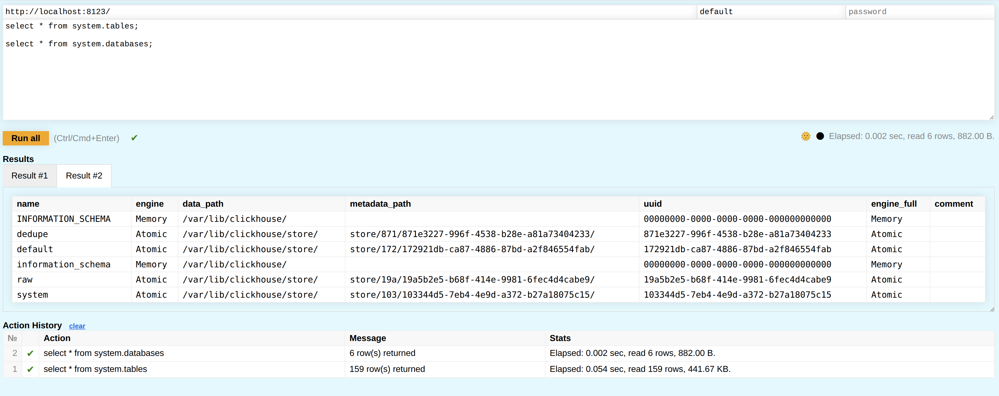

# ClickHouse Play - Recodified

A modified version of the ClickHouse play web interface with enhanced multi-statement support.

## Overview

The ClickHouse play front-end is a useful web-based SQL query tool and often the first interaction new users have with ClickHouse. This modified version addresses limitations in the original by adding support for working with multiple SQL statements.

## Improvements

This version adds the following enhancements:

- **Batch statement execution**: Run multiple SQL statements in a single batch
- **Selective execution**: Select and execute a subset of statements from the query editor, similar to most SQL front-ends
- **Query/result history pane**: Track results from previously executed statements

## Status

The tool is usable and functional in its current state but has some outstanding items for future improvement:

- Render multiple result set tables using tabs or similar UI pattern
- Decide whether to retain browser back/forward button history functionality or incorporate it into the result history table
  - If retained, result history needs to be stored in state along with results and query for proper restoration when users interact with the back button

## Motivation

The original play front-end only supports a single statement in the query editor, which can be frustrating for any serious work and requires constant copying and pasting from external sources. This modified version enables a more productive workflow for users learning or working with ClickHouse.