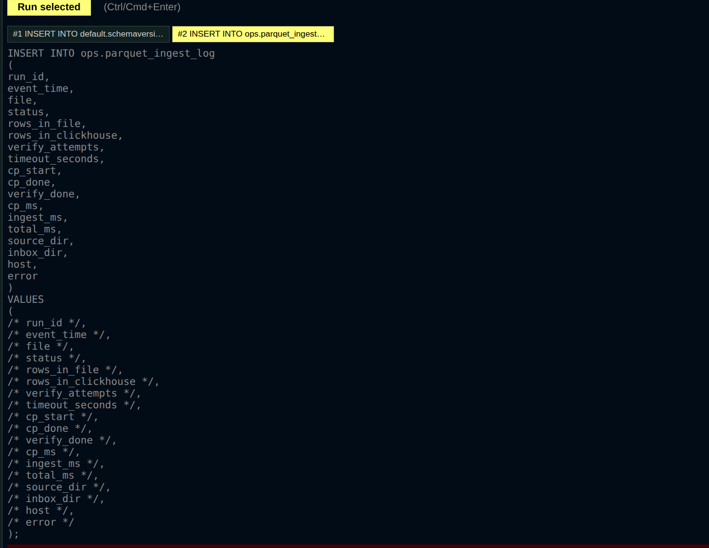
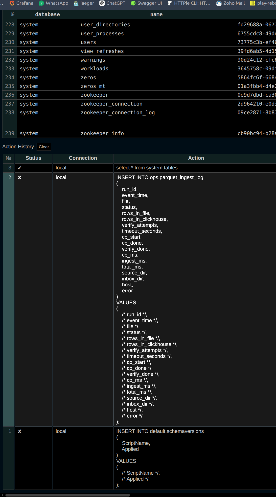
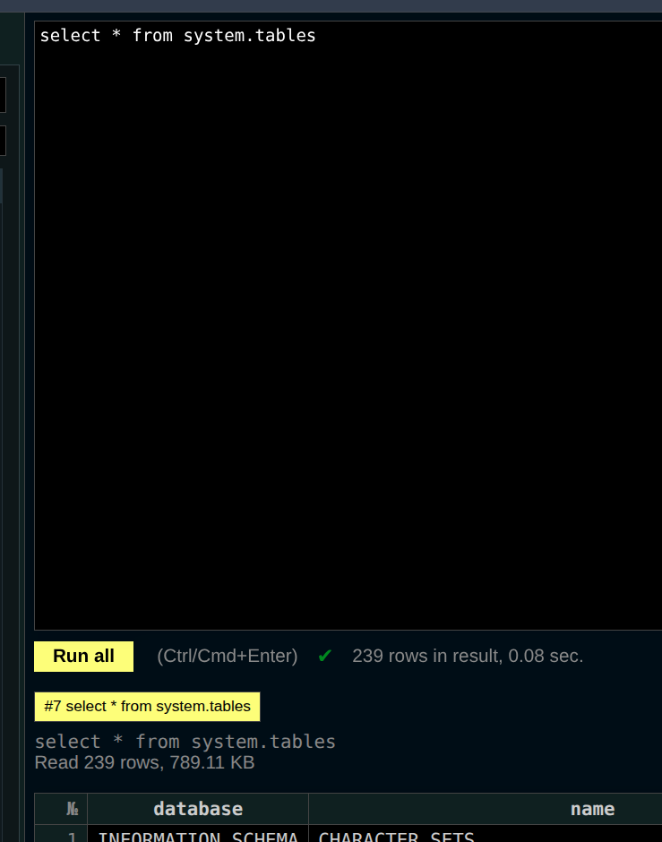
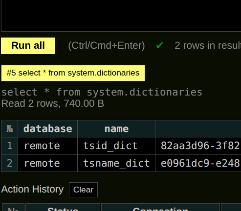
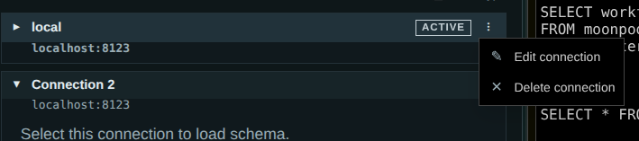
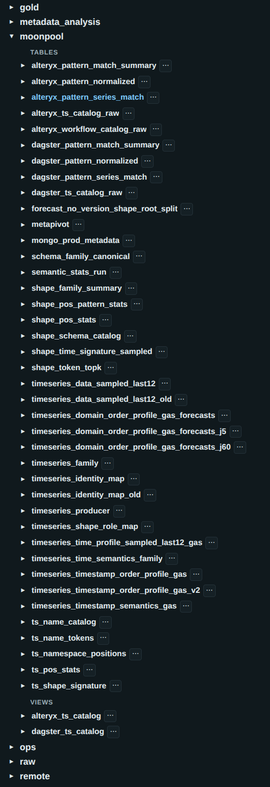

Target: play-reborn.html


1. [X] make it clearer what connection is active when working with a query, currently it's not easy to tell.
2. [ ]  - when the query being executed is long, it takes up a huge amount of the veritical space and pushses results way down the screen. We can tackle this in a few ways: reduce font size, remove newlines, display a truncated query with ..., not sure this here at all given it's already in the acton history and query editor
3. [ ]  - when the query results table is wide, it CAN be horizontally scrolled, however the scroll bar lives down below the action history so can be both hard to spot and also scrolls the action history, which isn't really whats intended.
4. [ ] |v2?| the bg color of the results pane seems to be a bit arbitary/inconsistent:
[alt text](color3.png) why is this?
5. [X] Add option to generate a select with all the column names in addition to this:
```javascript
{
            icon: '≡',
            label: is_view ? 'Generate SELECT from view' : 'Generate SELECT',
            onClick: () => insertTextIntoEditor(`SELECT * FROM ${database}.${table} LIMIT 100;`)
        }
```
6. [X] ability to colapse/expand all  items in the navigator tree for a given connection, to be aded alongside the current three dot menu
7. [X] It would be nice to have link to the dashboard e.g. hostname:81123/dashboard in the connection context menu: 
8. [X] Can we add a `generate drop table` to the table context menu please
9. [X] Connection manager prettify 
    - allow the view/tables sections to be collapsible/expandable
    - make the view/table section header text formating stand out a bit more, especially on the dark theme.
    - add icons for database, connection, table, view etc (font based)
10. [ ] |v2| session server settings pane as set doesn't work normally.
11. [ ] |v2| saved queries panel/admin queries pannel for things like table compression ratios etc
12. Copy to clipboard on results. Especially useful for resutls of things like show create table but would be nice on tabular results too (copy with headers, without headers, copy as format perhaps?. Bare in mind we might have multiple results tabs, so an options to copy from all tabs would be good too.