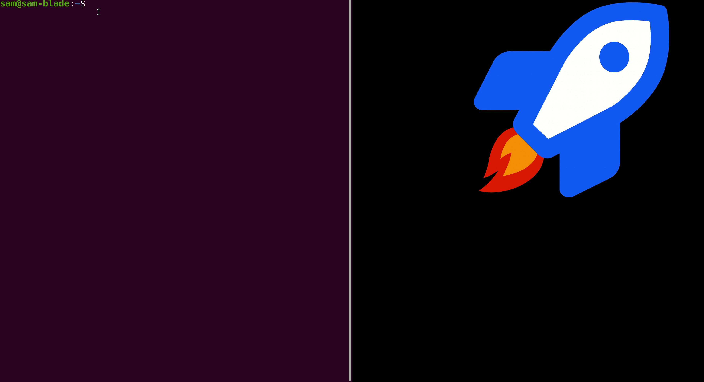

# chat-paste - Quick ChatGPT Paste Tool



A utility script that automatically pastes selected text or clipboard content to ChatGPT. Perfect for quickly sending code snippets, error messages, or text selections to ChatGPT without manual copy-paste.

## Features

- Automatically detects and uses selected text (PRIMARY selection) or clipboard content
- Opens ChatGPT in browser if not already open
- Focuses the ChatGPT window
- Pastes content into the input field
- Submits the message (via Enter key by default)
- Optional click-to-submit mode for UI automation
- Desktop notifications for user feedback

## Usage

```bash
./chat-paste.sh
```

The script will:
1. Get the current text selection (PRIMARY) or clipboard content (CLIPBOARD)
2. Open/focus ChatGPT in your browser
3. Paste the content and submit it

## Configuration

Set environment variables to customize behavior:

```bash
# Use click-to-submit instead of Enter key (default: 0)
export CLICK_SUBMIT=1

# Adjust click position for submit button (if CLICK_SUBMIT=1)
export CLICK_OFFSET_X=70  # pixels from right edge
export CLICK_OFFSET_Y=70  # pixels from bottom edge
```

## Dependencies

- `xclip` - for clipboard access
- `xdotool` - for window management and input automation
- `xdg-open` - for opening browser
- `notify-send` - for desktop notifications

## Installation

```bash
./install.sh
```

## Usage Example

Highlight some text and press right-windows key/right-⌘


## How It Works

1. **Selection Detection**: First tries PRIMARY selection (highlighted text), then CLIPBOARD
2. **Window Management**: Uses `xdotool` to find and focus ChatGPT browser window
3. **Content Insertion**: Copies content to clipboard and pastes it using Ctrl+V
4. **Submission**: Sends Enter key by default, or clicks submit button if configured

## Notes

- Designed for X11 environments (most Linux desktops)
- Submit button clicking is brittle and may break with ChatGPT UI changes
- Enter key submission is more reliable and recommended
- Best used with a keyboard shortcut for quick access