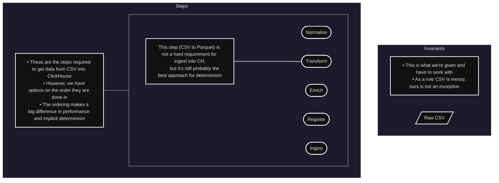

# UnifiedIngestor Architecture

## Executive Summary

The UnifiedIngestor system ingests high-volume CSV timeseries files, resolves long string series keys to integer IDs, and writes rows into ClickHouse while keeping the hot ingest path fast and non-blocking.

**Core Innovation:** Bind series names to integer IDs at write time using a ClickHouse dictionary, allow unknown names to land with ID 0, then reconcile later with a background worker that replays only the unresolved rows. This deferred reconciliation pattern keeps the hot path fast while ensuring downstream tables remain keyed on integers with no query-time binding costs.

## One Sentence Summary

Ingest uses ClickHouse as a deterministic compiler and write-time binder, unresolved rows land with ID 0, and a background worker registers missing keys then re-emits only the unresolved subset so downstream tables remain keyed on integers and never pay query-time binding costs.

## Design Principles

This implementation follows the architectural principles established in the companion white papers:

1. **Transformation semantics must match ingestion semantics** - clickhouse-local is ClickHouse itself, ensuring identical parsing and type coercion
2. **Stage-based filesystem workflow** - provides idempotency, auditability, and crash recovery
3. **Typed Parquet as the intermediate contract** - stable, performant, and inspectable
4. **Correctness before convenience** - downstream trust is a first-class constraint
5. **Operational clarity** - failures must be diagnosable without heroic debugging

## Goals

1. **High throughput on lots of small files** - handle high-volume CSV deliveries efficiently
2. **Deterministic parsing and typing** - consistent interpretation throughout the pipeline
3. **Bind identity once** - resolve string keys to integer IDs without repeated lookups
4. **Non-blocking ingestion** - new series registration happens asynchronously
5. **Integer-keyed ClickHouse tables** - physical storage uses efficient integer keys

## Vocabulary

- **timeseries_name**: Long string key from CSV files (column name in input is `ts`)
- **timeseries_id**: Integer surrogate key, authoritative mapping stored in Postgres
- **dict**: ClickHouse dictionary that replicates the Postgres mapping for fast local lookup
- **unresolved**: Row where timeseries_id is 0 because mapping did not exist at ingest time
- **ingest_batch_id**: UUID written with rows to scope queries, used for both ingest batches and reconciliation insert batches
- **hot path**: The primary ingestion flow handling existing, known timeseries (majority of traffic)
- **cold path**: The background reconciliation flow handling new timeseries registration

## The Problem Space

Understanding the building blocks helps clarify why the deferred reconciliation pattern is necessary.

### The Fundamental Steps

Every CSV-to-ClickHouse pipeline must perform these operations, though the order can vary significantly:





The critical decision is **when to perform enrichment/registration** relative to the other steps. This decision has profound implications for throughput, latency, and system complexity.

## Approach Comparison

### Sequential Approach

The sequential approach checks for series existence before ingestion and registers new series synchronously in the hot path.

```mermaid
---
config:
  theme: redux-dark
---
flowchart LR

n(["Registration is only required for new timeseries which are a tiny percentage of total"])

subgraph Flows["Processing Flows"]
    subgraph Alt["New Timeseries - Alternative Order"]
        CSVA[/Raw CSV/] -->
        NormaliseA(["Normalise"]) --> 
        NCSVA[/Normalised CSV/] -->
        newA(["Get New TS"]) --> 
        regA(["Register with PG"]) -->
        TransformA(["Transform"]) -->
        ParquetA[/Parquet/] -->
        pgA[("Postgres")] -->    
        IngestA(["Ingest"])     
    end

    subgraph Main["New Timeseries - Transform First"]
        CSV[/Raw CSV/] -->
        Normalise(["Normalise"]) --> 
        NCSV[/Normalised CSV/] -->
        Transform(["Transform"]) -->
        Parquet[/Parquet/] -->
        new(["Get New TS"]) --> 
        reg(["Register with PG"]) -->
        pg[("Postgres")] -->    
        Ingest(["Ingest"])     
    end

    subgraph Hot["Existing Timeseries - Hot Path"]
        CSVH[/Raw CSV/] -->
        NormaliseH(["Normalise"]) --> 
        NCSVH[/Normalised CSV/] -->
        TransformH(["Transform"]) -->
        ParquetH[/Parquet/] -->
        pgH[("Postgres")] -->    
        IngestH(["Ingest"])     
    end
end

subgraph Clickhouse["ClickHouse"]
    tsraw[["raw.ts"]] --> silver[["silver"]] --> gold[["gold"]]                        
end
 
Ingest --> tsraw
IngestA --> tsraw
IngestH --> tsraw


classDef warning  fill:#422006,stroke:#f59e0b,stroke-width:2,color:#fffbeb;

class new,reg,newA,regA,n warning

classDef sghot fill:#020617, stroke:#34d399, stroke-width:2,rx:12,ry:12;
classDef sgNew fill:#020617, stroke:#60a5fa, stroke-width:2;
classDef sgNewDashsed fill:#020617, stroke:#60a5fa, stroke-dasharray:6 6,stroke-width:2;
classDef sgContainer fill:#020617, stroke-width:2;
classDef sgCanvas fill:transparent, stroke:transparent, stroke-width:2,rx:12,ry:12;
classDef sgLegend fill:#020617, stroke-width:2,rx:12,ry:12;

class T sgLegend;
class Con2 sgCanvas;
class Main sgNew;
class Clickhouse,Consolidated,Con sgContainer
class Alt sgNewDashsed
class Hot sghot;

```





**Notes**

- This is the high-level sequential logical flow as implied from a C#-only ingest process
- Physical implementation specifics like caches are not covered
- The order could be adjusted, as shown by the two flows
- The 'Hot path' flow shows what is required for almost all data we receive

**How it works:**

For each file, the system must determine which timeseries are new (not yet registered) and which are known:

1. Parse the CSV to extract all unique timeseries names
2. Query Postgres to check which names already have IDs
3. For new names: register them in Postgres and wait for ID assignment
4. Transform the CSV to Parquet, joining with the ID mappings
5. Ingest the Parquet into ClickHouse

**Characteristics:**

- **Synchronous blocking**: New series registration blocks the ingestion of that file
- **Postgres in the hot path**: Every file requires at least one Postgres query (check for existing IDs)
- **Simple mental model**: Each file is completely processed before moving to the next
- **No deferred work**: Once ingestion completes, all rows are fully resolved

**Performance implications:**

- Network round-trip to Postgres for every file
- New series cause additional latency (INSERT + wait for ID)
- Batch processing helps but doesn't eliminate the blocking behavior
- Works well for low-volume or when most series are pre-registered

**When this works well:**

- Low file volume (hundreds per day, not thousands)
- Stable timeseries catalog (few new registrations)
- Acceptable to have occasional slow files when new series appear
- Simpler codebase is worth the throughput tradeoff

### Deferred Approach: RDBMS World

To understand the deferred approach, it helps to see how you would implement it in a traditional RDBMS context first.

```mermaid
---
config:
  theme: redux-dark
---
flowchart TB

subgraph Staging["Staging Database"]
    db[("staging.timeseries
    (id = 0 for unknown)")]     
    db2[("production.timeseries
    (only resolved rows)")]
    db --"periodic promotion
    (WHERE id > 0)"--> db2
end
  
subgraph HotPath["Hot Path - Always Non-Blocking"]
    CSVc[/Raw CSV/] -->
    Normalisec(["Normalise"]) --> 
    NCSVc[/Normalised CSV/] -->
    Transformc(["Transform"]) -->
    Parquetc[/Parquet/] -->                    
    Ingestc(["Ingest with
    LEFT JOIN to ID mapping"]) 
    Ingestc --"existing: id > 0"--> db
    Ingestc --"new: id = 0"--> db
end

subgraph ColdPath["Cold Path - Registration Loop"]
    loop(["Every N seconds"]) -->
    detect(["1. Detect unresolved
    (WHERE id = 0)"]) -->
    register(["2. Register new series
    with Postgres"]) -->
    replay(["3. Re-insert unresolved rows
    with new IDs"]) -->
    promote(["4. Promote to production
    (WHERE id > 0)"])
    
    detect --"read unresolved"--> db
    register --"write new IDs"--> pg[("Postgres
    (source of truth)")]
    replay --"update staging"--> db
    promote --"write resolved"--> db2
end

class new,reg,newA,regA,n warning

classDef sgHot fill:#020617, stroke:#34d399, stroke-width:2,rx:12,ry:12;
classDef sgNew fill:#020617, stroke:#60a5fa, stroke-width:2;
classDef sgNewDashsed fill:#020617, stroke:#60a5fa, stroke-dasharray:6 6,stroke-width:2;
classDef sgStartDashsed fill:#020617, stroke:#34d399, stroke-dasharray:6 6,stroke-width:2;
classDef sgContainer fill:#020617, stroke-width:2;

class HotPath sgHot;
class Staging sgNew
class ColdPath sgNewDashsed
class loop sgStartDashsed;
class Hot sghot;

```





#### Deferred RDBMS: How It Works

This pattern is common in RDBMS-based systems that need high-throughput ingestion without blocking on reference data lookups.

**Hot Path (Non-Blocking):**

1. Transform CSV to Parquet using clickhouse-local (deterministic parsing)
2. Ingest into `staging.timeseries` with a LEFT JOIN to the ID mapping table
3. Known series get their correct ID immediately
4. Unknown series land with `id = 0` (or NULL, depending on design)
5. **Critically:** Ingestion never waits or fails due to missing IDs

**Cold Path (Background Worker):**

1. **Detect**: Query `staging.timeseries WHERE id = 0` to find unresolved rows
2. **Register**: INSERT new series into Postgres to get authoritative IDs
3. **Replay**: Re-insert the unresolved rows from staging, this time with real IDs
4. **Promote**: Move rows with `id > 0` to the production table

**Why the staging table?**

In RDBMS world, you need a separate staging table because:

- Production tables should only contain clean, fully-resolved data
- You want ACID guarantees around the "resolve and promote" operation
- The staging table acts as a queue for deferred work
- Queries against production tables never see unresolved rows

**Key insight:**

The deferred pattern splits the work into two phases:

- **Phase 1 (hot)**: Get data in quickly, even if incomplete
- **Phase 2 (cold)**: Clean up and complete the data in the background

This is a proven pattern in high-throughput systems (e.g., event streaming, CDC pipelines).

### Deferred Approach: ClickHouse World

ClickHouse allows us to implement the deferred pattern more elegantly using dictionaries and materialized views.

```mermaid
---
config:
  theme: redux-dark
---
flowchart TB

subgraph Staging["    "]
    StagingLayerTitle["Staging Layer"]:::tSection
    dict[/"tsname_dict
    (Postgres-backed dictionary)"\]
    db[["staging.ts_stage
    (all rows, resolved & unresolved)"]]                
    mv["raw.stage_to_raw_mv
    (promotes WHERE id > 0)"]
    
    dict -.->|"dictGet() during INSERT"| db
    db -->|"automatic trigger"| mv
end

subgraph Production[" "]
    ProductionLayerTitle["Production Layer"]:::tSection
    tsraw[["raw.timeseries"]] --> silver[["silver"]] --> gold[["gold"]]  
    
end
  
subgraph HotPath["  "]
    HotPathTitle["Hot Path - Always Non-Blocking"]:::tSection
    CSVc[/Raw CSV/] -->
    Normalisec(["Normalise"]) --> 
    NCSVc[/Normalised CSV/] -->
    Transformc(["Transform
    (clickhouse-local)"]) -->
    Parquetc[/Parquet/] -->                    
    Ingestc(["INSERT SELECT
    with dictGet()"]) 
    Ingestc --"id = dictGet(name)
    (0 if not found)"--> db    
end

subgraph ColdPath["  "]
    ColdPathTitle["Cold Path - Registration Loop"]:::tSection 
    loop(["Every N seconds"]) -->
    detect(["1. Detect unresolved
    using dictHas()"]) -->
    register(["2. Bulk register
    via pg_remote table"]) -->
    wait(["3. Wait for dict refresh"]) -->
    replay(["4. Re-insert with
    dictGet() for new IDs"])
    
    detect -.->|"dictHas() check"| dict
    register -->|"INSERT via remote"| pg[("Postgres
    (source of truth)")]
    replay -->|"INSERT SELECT"| db
end
mv -->|"only id > 0"| tsraw
HotPathTitle---CSVc

ColdPathTitle---loop
StagingLayerTitle --- dict
gold --- ProductionLayerTitle 

%% classDef staging fill:#e3f2fd,stroke:#1976d2,stroke-width:2px
%% classDef hot fill:#c8e6c9,stroke:#388e3c,stroke-width:2px
%% classDef cold fill:#fff3e0,stroke:#f57c00,stroke-width:2px
%% classDef prod fill:#f3e5f5,stroke:#7b1fa2,stroke-width:2px

%% class dict,db,mv staging
%% class CSVc,Normalisec,NCSVc,Transformc,Parquetc,Ingestc hot
%% class loop,detect,register,wait,replay cold
%% class tsraw,silver,gold prod
linkStyle 18 stroke:transparent,stroke-width:2px;
linkStyle 19 stroke:transparent,stroke-width:2px;
linkStyle 20 stroke:transparent,stroke-width:2px;
linkStyle 21 stroke:transparent,stroke-width:2px;

classDef tSection fill:transparent,stroke:transparent,color:#e5e7eb,font-family:Consolas,font-size:22px,font-weight:800;
classDef warning fill:#422006,stroke:#f59e0b,stroke-width:2,color:#fffbeb;
class new,reg,newA,regA,n warning

classDef sghot fill:#020617, stroke:#34d399, stroke-width:2,rx:12,ry:12;
classDef sgNew fill:#020617, stroke:#60a5fa, stroke-width:2;
classDef sgNewDashsed fill:#020617, stroke:#60a5fa, stroke-dasharray:6 6,stroke-width:2;
classDef sgStartDashsed fill:#020617, stroke:#34d399, stroke-dasharray:6 6,stroke-width:2;
classDef sgContainer fill:#020617, stroke-width:2;
classDef sgClickhouseDashed fill:#020617, stroke:#FFDF0E, stroke-dasharray:6 6,stroke-width:2;
classDef sgClickhouse fill:#020617, stroke:#FFDF0E;

class ColdPath sgNewDashsed;
class Clickhouse,RDBMS,Staging sgContainer
class Register sgNewDashsed
class loop sgStartDashsed;
class HotPath sghot;
class Staging sgClickhouseDashed;
class Production sgClickhouse;
```





#### Deferred ClickHouse: How It Works

ClickHouse's dictionaries and materialized views make this pattern both elegant and performant.

**Hot Path (Non-Blocking):**

1. Transform CSV to Parquet using clickhouse-local (deterministic parsing)
2. INSERT into `staging.ts_stage` with `dictGet('tsname_dict', 'id', timeseries_name)`
3. Known series: `dictGet()` returns the real ID
4. Unknown series: `dictGet()` returns 0 (default for missing keys)
5. **All rows land in staging** regardless of resolution status

**Materialized View (Automatic Promotion):**

```sql
-- Materialized view automatically promotes resolved rows
CREATE MATERIALIZED VIEW raw.stage_to_raw_mv TO raw.timeseries AS
SELECT *
FROM staging.ts_stage
WHERE timeseries_id > 0;
```

The MV acts as a **filter trigger**: as soon as a row has `timeseries_id > 0`, it's automatically promoted to the production `raw.timeseries` table.

**Cold Path (Background Worker):**

1. **Detect**: Use `dictHas('tsname_dict', timeseries_name)` to find unresolved names
   - This is more efficient than scanning for `id = 0`
   - Leverages ClickHouse's optimized dictionary engine

2. **Register**: Bulk INSERT into Postgres via `staging.pg_timeseries_remote`
   ```sql
   INSERT INTO staging.pg_timeseries_remote (timeseries_name, ingestion_key)
   SELECT DISTINCT 
       timeseries_name,
       base64Encode(timeseries_name) as ingestion_key
   FROM staging.ts_stage
   WHERE NOT dictHas('tsname_dict', timeseries_name);
   ```

3. **Wait for dictionary refresh**: 
   - Dictionary has `LIFETIME(1)` (refreshes every 1 second)
   - Could poll `system.dictionaries.last_successful_update_time` for certainty

4. **Replay unresolved rows**:
   ```sql
   INSERT INTO staging.ts_stage
   SELECT 
       dictGet('tsname_dict', 'id', timeseries_name) as timeseries_id,
       timeseries_name,
       -- ... all other columns
       generateUUIDv4() as ingest_batch_id  -- new batch ID for tracking
   FROM staging.ts_stage
   WHERE timeseries_id = 0;
   ```

5. **Automatic promotion**: The MV sees the new rows with `id > 0` and promotes them

**Why This Is Better Than RDBMS:**

1. **Dictionaries are fast**: In-memory, vectorized lookups
2. **Materialized views are automatic**: No manual promotion code
3. **No transaction overhead**: ClickHouse's eventual consistency model fits naturally
4. **Bulk operations**: All lookups and inserts are vectorized
5. **Less code**: Leverage ClickHouse primitives rather than application logic

**Why staging.ts_stage keeps duplicates:**

- Unresolved rows remain with `id = 0`
- When replayed, new resolved rows are inserted with `id > 0`
- This creates an audit trail of the resolution process
- Downstream systems read from `raw.timeseries` (via MV) which has no duplicates
- `staging.ts_stage` can have aggressive TTL if audit trail not needed

## Data Stores and Objects

### Postgres

**Table: public.timeseries**

The authoritative source of truth for timeseries ID mappings.

- **Columns**: `id` (serial), `timeseries_name` (text, unique), `ingestion_key` (text), metadata fields
- **Purpose**: Single source of truth for name → ID mappings
- **Access pattern**: Bulk writes from ClickHouse via remote table, reads via dictionary refresh

### ClickHouse

#### 1. staging.tsname_dict

ClickHouse dictionary backed by Postgres, provides fast local lookups.

```sql
CREATE DICTIONARY staging.tsname_dict (
    timeseries_name String,
    id UInt32
)
PRIMARY KEY timeseries_name
SOURCE(POSTGRESQL(...))
LAYOUT(HASHED())
LIFETIME(MIN 1 MAX 1);  -- Refresh every 1 second
```

- **Source**: Postgres `public.timeseries` table
- **Primary key**: `timeseries_name`
- **Refresh mechanism**: `LIFETIME(1)` ensures fresh data
- **Default behavior**: `dictGet()` returns 0 for missing keys

#### 2. staging.ts_stage

MergeTree table storing all ingested rows, including unresolved rows.

**Key columns:**

- `timeseries_id` (UInt32) - 0 for unresolved, >0 for resolved
- `timeseries_name` (String) - the series key from CSV
- `period_start`, `period_end`, `published_date_time` (DateTime64) - temporal fields
- `quantity` (Decimal128(18)) - the measurement value
- `as_of_date_time`, `model_as_of_date_time` (DateTime64) - versioning fields
- `source_file` (String) - original CSV filename
- `source_type` (Enum8) - 'RAW' or 'DERIVED'
- `extras` (String) - JSON for additional metadata
- `ingest_batch_id` (UUID) - batch tracking identifier
- `staged_at` (DateTime64) - timestamp of insertion

**Order by**: `(timeseries_id, timeseries_name)` for efficient filtering

**Characteristics:**

- Acts as an audit log of all ingestion attempts
- Contains duplicates by design (unresolved + resolved versions)
- Can be queried for debugging and replay scenarios
- Aggressive TTL recommended if audit trail not needed long-term

#### 3. raw.stage_to_raw_mv

Materialized view that promotes only resolved rows.

```sql
CREATE MATERIALIZED VIEW raw.stage_to_raw_mv TO raw.timeseries AS
SELECT 
    timeseries_id,
    timeseries_name,
    period_start,
    period_end,
    published_date_time,
    quantity,
    as_of_date_time,
    model_as_of_date_time,
    source_file,
    source_type,
    extras,
    ingest_batch_id,
    staged_at
FROM staging.ts_stage
WHERE timeseries_id > 0;
```

- **Trigger**: Fires on every INSERT to `staging.ts_stage`
- **Filter**: Only rows with `timeseries_id > 0` are promoted
- **Target**: `raw.timeseries` (the production table)
- **Effect**: Automatic, immediate promotion of resolved rows

#### 4. staging.pg_timeseries_remote

ClickHouse PostgreSQL engine table for writing back to Postgres.

```sql
CREATE TABLE staging.pg_timeseries_remote (
    timeseries_name String,
    ingestion_key String
)
ENGINE = PostgreSQL(
    'postgres_host:5432',
    'database',
    'timeseries',
    'user',
    'password'
);
```