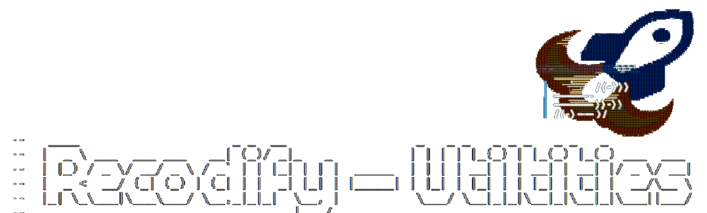

# Recodify Utils



A collection of command-line utilities designed to help system administrators and developers with common tasks, diagnostics, and performance measurements.

## Available Tools

### Development Experience (DevEx)
- **[mkpr - GitHub PR Helper](devex/github/README.md)** - Quickly open GitHub pull request creation pages from command line
- **[Claude Code Commands](devex/claude/README.md)** - Custom Claude Code commands for development workflows
- **[disable-capslock](devex/general/README.md)** - Portable script to disable or remap Caps Lock across Linux environments
- **[chat-paste](devex/general/chat-paste/README.md)** - Automatically paste selected text to ChatGPT and submit

### System Tools
- **[tx-benchmark](tools/README.md)** - File transfer benchmarking tool for performance testing
- **[mnt-forever](tools/README.md)** - Easy NFS and SMB mount setup with persistence

### Infrastructure
- **[tfp - Terraform Plan Helper](infra/terraform/README.md)** - Run terraform plan with resource change summaries

## Installation

```bash
git clone https://github.com/username/system-utils.git
cd system-utils
chmod +x *.sh
```

## Usage

Each tool has its own documentation with detailed usage instructions. Click the links above to view specific tool documentation.

## Roadmap

- More tools will be added in the future.

